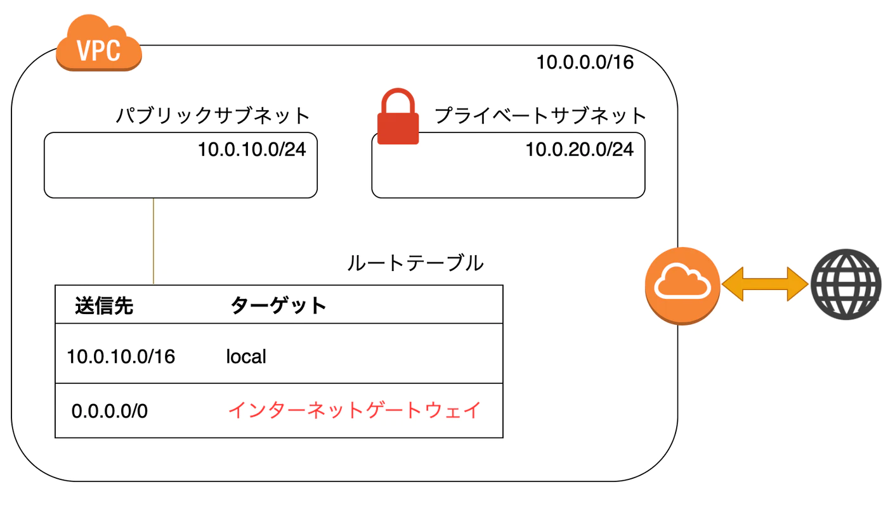

# AWSでネットワークを構築する
作成日時:2021/11/11

## 1.インターネットが繋がる仕組み
* 👀IPアドレスとルーティング
  * IPアドレス
    * ネットワーク上の住所
      * グローバルIPアドレス
        * 多くの人が接続するインターネット上の住所
      * プライベートIPアドレス
        * 特定の環境内での住所
  * ルーティング
    * 経路（どこからどこまで、どうやって情報をとどけるのか）
* 参考：https://milestone-of-se.nesuke.com/nw-basic/grasp-nw/about-internet/

## 2.AWSでネットワークを構築する
* 用語
  * VPC
    * 仮想のネットワークスペース
    * 様々な用途のネットワークを作成することができる
      * 例
        * ユーザーへサイトを表示するため
        * 社内のツールを社員に提供するため
        * APIでデータを提供するため
  * サブネット
    * VPCを細かく分割したネットワーク
    * VPCのアドレス内にサブネットのIPアドレスが含まれる
      * [VPCネットワーク->サブネット（含まれる）](https://wa3.i-3-i.info/word11973.html)
    * パブリックサブネット
      * インターネットから接続できる
    * プライベートサブネット
      * インターネットから接続できない
  * ルートテーブル
    * VPC内に存在している小さなネットワーク（サブネット）ごとに「どこへ接続できるのか」経路を定義したもの
    * ネットワーク内のアクセス経路を設定することでセキュリティ対策、過負荷対策などができる
  * セキュリティグループ
    * インスタンス単位で設定できるファイアウォール
    * どのインスタンスがどこと通信できるか制御するもの
    * 通信の許可・禁止を細かく定義できる
  * インターネットゲートウェイ
    * VPC内からインターネットへ接続するための門
    * VPC内のシステムがグローバルIPアドレスをつかえるようになる
  * NAT ゲートウェイ
    * VPC内にあるプライベートサブネットからインターネットへ接続するためのゲートウェイ
    * プライベートサブネット自身は、インターネットへ接続することは出来ないが、プライベート内にあるリソースをインターネットへ公開したいときに使用
    * NATゲートウェイを通じて、プライベートサブネットーパブリックサブネットを間接的に繋げることでインターネットへの接続を実現する
    * 別のIPアドレスどうしを関連付けて変換する技術
  * Virtual Private Gateway
    * オンプレ環境に接続するためのゲートウェイ
    * 自社拠点やデータセンターとVPCを接続するときに使用する
  * VPC / Interface エンドポイント
    * インターネット接続ができないサブネットから各種AWSサービスを使用するためのアクセスポイント
    * AWSサービスの中でも、VPCの外に設置して使用するサービスを利用する場合に使用
      * 例
        * Amazon S3など
  * [AWSでネットワークを構築するときに使うものを簡単にまとめてある](https://qiita.com/kono-hiroki/items/6863aa06754fb25f28fc)
  * [AWSに関連した色んな用語集](https://www.bit-drive.ne.jp/managed-cloud/column/column_31.html)
* サービス
  * Amazon VPC
    * ネットワーク上に仮想のスペースを作成できる
    * VPCの中にサーバーやIPサブネットをなどのリソースを設置することで、クラウド内の通信やインターネットへの公開ができる
  * AWS Direct Connect
    * 大量のデータを高速、かつセキュアに通信したい際に用いる仮想の専用網
  * Amazon Route 53
    * 独自DNS名を割り当て、管理することのできるサービス

## 3.VPC、サブネット、インターネットゲートウェイ、NATゲートウェイの関係
* VPC内に設置するもの
  * パブリックサブネット
    * NATゲートウェイ
  * プライベートサブネット
* VPC外に設置するもの
  * インターネットゲートウェイ

* 関係性：構成例
sa
出典元：https://qiita.com/kono-hiroki/items/6863aa06754fb25f28fc
