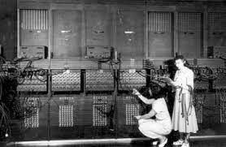

# プログラミング言語を俯瞰する
作成日時:2021/6/8

## 1.プログラミング言語が誕生した経緯
* 1830年ごろチャールズ・バベッジが機械式コンピュータを開発
  * パンチカードで
* 1946年に誕生したENIACは電気計算機としてコンピュータのような役割をはたす
  * 以前のプログラミングは、スイッチと配線でプログラムを設定するものだった
   

毎回、配線を入れ替えるのって面倒だよね？？？
もっと楽にする方法は無いだろうか？

**プログラム内臓方式のはじまり**

* 1949年に誕生したEDSACでは、穴を開けた紙テープでデータを表現し読み込ませるしくみへ
  * 配線を繋ぎ変える方式から紙テープを読み込ませる方式へ変化
  * 機械語で表現するため、人間には難しいものだった

* 1954年FORTRANの誕生
  * 数値計算用プログラミング言語
  * 組み込み関数や配列操作をするプログラムが組み込まれている
  * 数式を変換して、機械語にしてくれる
  * 難しい機械語から、人間が理解しやすい数式でプログラムをかけるようになる
  * 少ないコードでプログラムを組むことができるように

> FORTRANは、人間が理解しやすく手動で機械語を操作するのと同じ効率を維持しながら、反復的なタスクをすべて実行できることを目標に開発された。

開発者のJohn Backusによると、
> Backusは、実行したハードウェアからソフトウェアを抽象化し、特定の結果が得られるまで何度も繰り返される一連の命令を使用して「ループの編成を機械化」したいと考えていました。 1979年のインタビューで、彼は次のように述べています。私はプログラムを書くのが好きではなかったので、IBM 701でミサイルの軌道を計算するためのプログラムを書いていたとき、プログラムを書きやすくするためのプログラミングシステムの作業を始めました。」このイデオロギーは、「プログラマーは怠惰である」という概念の始まりであった可能性があります。
参照：[Fortran：革新的なプログラミング言語](https://ichi.pro/fortran-kakushinteki-na-puroguramingu-gengo-167320850628792)

楽に計算を行うようにしたいという思いが、当時革新的だったプログラミング言語の誕生に影響を与えている。

参考：[プログラミングとコンピュータの歴史](https://acthouse.net/column/programming-computer/)

## 2.エンジニアの三大美徳
1. 怠慢(Laziness)
   * 全体の労力を減らすために手間を惜しまない気質
      * めんどくさい作業を減らすために自動化する
2. 短気(Impatience)
  * コンピュータが怠惰なときに感じる怒り(# ﾟДﾟ)
    * 今後の問題を考えて、依存関係の小さいコードを書く
    * 柔軟に対応できる設計にしておく
3. 傲慢(Hubris)
   * 神罰がくだるほどの過剰な自尊心
   * 人様に対して恥ずかしくないプログラムを書き、保守しようとする気質
     * 自分の書いたコードに責任を持ち、さらに保守性を上げようとする努力

結論：
「あらゆる面で、楽をするためにどうすれば良いか考える」
めんどくさがりのプロ。

参照：[プログラマーの三大美徳](https://moneyforward.com/engineers_blog/2016/02/08/engineers-virtue/)
## 3.プログラミング言語の目的
* FORTRANは、数値の計算を楽にするために開発された言語
* Perlは、レポートの作成を楽にするために開発された言語
* C＋＋は、コードの高速さをとても重視している言語
* PHPは、Webサービスを構築することが楽になる言語

プログラミング言語は、楽になるための道具。
しかし、何を楽にするのか？という目的や特徴はそれぞれで異なる為、適材適所。
