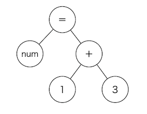

# 文法の誕生
作成日時:2021/6
## 1.文法とは？
> 文法とは、プログラミング言語の設計者が決めた
> 「こう書いたら、こういう意味に解釈する」
> というルールです。

## 2.構文木
各プログラミング言語によって、文法が異なる。

しかし、数値の計算を構文木で表現すると似たような図になる。

↓構文木の例

## 3.文法も何かを楽にする役割があるのか？
FORTRANは、数学の文法でプログラムを書くことを意識して作られた言語。その為、言語独特の数値計算式を書かずに人間が書きやすい書き方でプログラムを書くことができる。

プログラミング言語の中には、「なぜこんな書きにくい文法なんだ！！」と思うような文法も存在する。これは、矛盾なく構文を解析できるような文法を組み立てるのが難しいため、書きにくい文法となっている。

特に、新しい文法は既存の文法と矛盾しないように文法を組み立てるのが難しいため、書きにくい文法を継承してしまうこともある。

## コラム：理解するためのアウトプット
プログラミング言語は機会とのコミュニケーションを行う言葉。
英語は、相手がいないと学習した成果のアウトプットを行いにくい。例えば、会話や間違えた言葉の修正など。

しかし、機械があればいつでもどこでもアウトプットできる。
プログラミング言語はプログラムを構築して実行すると、機械が細かくチェックを行ってくれる。プログラマーが書いたプログラムが理解できなければ、分からなければエラーとして「ココが分からない！！！ココの書き方変だよ！！！」と教えてくれる。

その為、エラーが苦手な人もいるが、機械としっかり向き合あわなければ、言語処理系とのコミュニケーションができるはずもない。