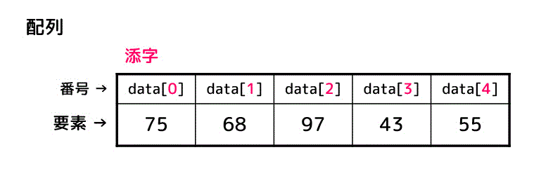
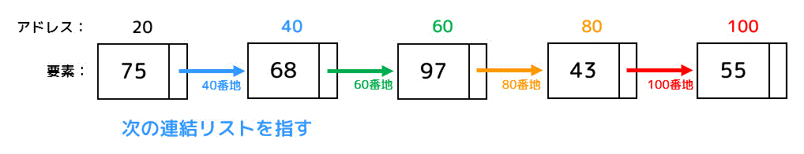

# コンテナと文字列
作成日時:2021/8/9

## 1.コンテナ
* コンテナ（この本での定義）
  * いくつものモノを入れるための入れ物
* コンテナには複数の種類がある
  * コンテナの種類によって、メモリへの格納の仕方が異なる
    * 長所と短所の複数化へ（コンテナが複数する種類存在することになる）
* コンテナに入れたデータはメモリへ格納する

## 1-2.配列と連結リスト
* 配列
  * メモリ上の箱に、格納した順番でデータを格納していく
  
    * 1つ目のメモリは0からスタート
* リスト
  * メモリ上の箱に、格納データと次のデータが入っている番地を保存している
  
  * データと次のデータの番地が入っているので、配列と比較して2倍のメモリを使用している
    * この特徴の長所
      * 1つの要素の挿入に掛かる時間
      * 例：(100)Ａ->(101)102->(102)Ｂ->(103)104->(104)Ｃ
        * 上記のＡとＢの間にＺを挿入したい時
        * 配列
          * 順番に挿入していくため、後から挿入する場合は、すでに挿入しているデータを1つずつ場所を移動させる必要がある
          * もし、格納しているデータが10,000個くらいある場合は、10,000回データをコピーして移動を行う必要がある
        * リスト
          * 次のデータの位置をメモリに保存しているため、Zを格納した後、Aの次の値にZの番地へ書き換えればOK
          * リストでは、Z用のメモリを2つ作成（データと番地）し、1つのメモリのデータを書き換えるだけで対応できる
          * 10,000個データが入っていても、追加データ用のメモリ作成と番地の編集のみ
      * 格納しているデータの個数が多い場合は、リストのほうがデータの追加が行いやすく、時間が掛かりにくい
      * 一方で、n番目の要素がどこにあるのか調べるのには時間が大幅にかかる
        * 配列は、0番目から順番にデータが入っているので、指定された番地をすぐに見に行ける
        * 各要素を好きなところに配置して、次のデータまでの番地をメモリに記載しているだけなので、1つずつデータの場所を指定された番地までの回数繰り返す必要がある
* 参考：[うさぎでもわかる配列と連結リスト](https://www.momoyama-usagi.com/entry/info-algo-list)

## 1-3.辞書・ハッシュ・連想配列
* もう一つのコンテナ
  * 辞書、ハッシュ、連想配列
* 辞書
  * 辞書と配列のちがい
  * 配列
    * インデックス番号と値が対応付けられたデータの集まり
    * 例：0番目の値は、りんごだよ
  * 辞書
    * 文字列（辞書のキー）と値が対応付けられたデータの集まり
    * 例：秋の値は、柿だよ
  * ハッシュテーブル
    * ハッシュ関数を使用して文字列と値の対応付けを行う
    * ハッシュ関数とは？
      * ちらし関数
      * 文字列を引数にとって整数を返す
      * 例：こんにちは -> 765dfghj7645fghu

## O記法
- アルゴリズムの良し悪しを正確に測るには、実行時間だけでは不十分
  - 計算量を用いる
    - 時間計算量
      - 実行がはじまって実行が終わるまでの命令が実行された回数（ステップ数）はどれくらいか
    - 空間計算量
      - アルゴリズムを解く時にどれだけの空間（メモリ）を使用するか
    - ２つの計算量
      - 最悪計算量
        - 一番ステップ数が多い条件を考える
        - 例：for文なら、とにかループする状態のこと
      - 平均計算量
        - if文やfor文など最悪計算量を生み出しそうなアルゴリズムを使わない場合を想定する
        - 最悪計算量だけだと、実際の計算量よりも大幅に超過した予測になってしまう
        - 最悪と非最悪の2つを考慮した平均を求める事で、より実際に近づくようにする
  - オーダーとは？
  > オーダー記法では、入力数  が十分に大きいときのステップ数を大雑把に見積もることができます。オーダー表記では、
  > 1. 一番大きい項以外は無視
  > 2. 定数倍の違いは無視
  > 3. 計算結果をビックオー表記にする
  > して考えます。
  - 良く表記されるオーダー
    -  O(n)
       -  定数時間
       -  nに比例した回数の計算ステップを要する 
       -  データ数nに比例してステップ数もn倍になる
    -  O(n2)
       -  二乗時間
       -  n2に比例した回数の計算ステップを要する
       -  O(n)の処理を2重にしたアルゴリズム
          -  イメージ：for文をしてfor文をするなど
    -  O(n log n)
       -  定数時間
       -  n log nに比例した回数の計算ステップを要する
       -  O(n)とO(log n)が合体したアルゴリズム
          -  O(log n)
             -  対数時間
             -  データ数nとステップ数が対数logに比例するアルゴリズム
  - ランダウのO記法
    - 概ねn2回に比例する計算時間を要するO(n2)のアルゴリズムである
    - 時間とアルゴリズムが何ステップで処理をするかという数値が比例の関係になっている

- ※n2はnの二乗を表現している
- 参考：
  - [[初心者向け] プログラムの計算量を求める方法](https://qiita.com/cotrpepe/items/1f4c38cc9d3e3a5f5e9c)
  - [プログラムの計算量、オーダー表記 O( ) の求め方のまとめ](https://www.momoyama-usagi.com/entry/calc-order)
  - [計算量オーダーの求め方を総整理！ 〜 どこから log が出て来るか 〜](https://qiita.com/drken/items/872ebc3a2b5caaa4a0d0)

## 文字列（最低限で！）
* xxxxをxxxとする。
→
* xxxxをxxxとする。
→
