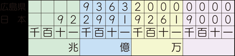
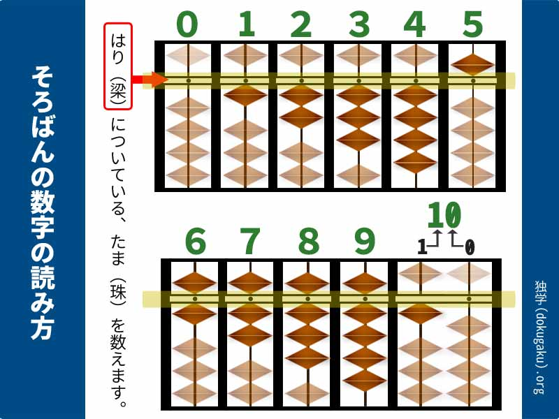
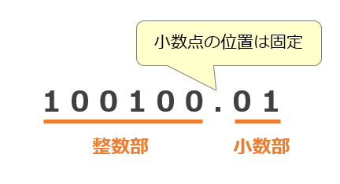

# 型
作成日時:2021/7/21

## 1.型とは
* コンピュータの中にある情報は、0/1・on/off（ビット）のみ
* ビット列だけでデータの細かい情報まで再現することは難しい
  * 例：数字の２とテキストの２では人間にとって表現したいものがことなる
* 「型」＝数値の種類の解釈を明確にするために追加された情報

## 2.数値をオンとオフで表現する方法
* 整数や少数を美っと列で再現するには？
  * コンピュータが理解できるon/off、0/1のあつまりで表現する

* 数を表現する歴史

* 整数
  * 位取りで表現する

       
    出典：[十進位取り記数法](https://www.shinko-keirin.co.jp/keirinkan/sansu/WebHelp/01/page1_21.html)

    * 一の位
    * 十の位
    * 百の位…
      * １つの位で0~9までの数字を表現できる
      * 数値が大きくなれば、必要な位の数も増えていく
        * 3桁の数字をランプで表現する時、一の位・十の位・百の位に９個ずつ計27個のランプがあれば表現できる
        * 999個→27個
        * もっと少ないランプ数で表現することはできないか？

  * 7セグメントディスプレイ
    * 位に表現する数字を7個のランプで表現したもの
    * コンピュータの誕生前に発明されている
      * 使用例：電卓

       
    出典：[7セグメントコードの反転（Ruby）](https://obelisk.hatenablog.com/entry/2017/12/29/061237)

        * 7個のランプで1桁の数字が表現できるため、3桁の数字は21個のランプで表現できる
          * 27個→21個
          * もっと少ないランプ数で表現することはできないか？

  * そろばん
    * 0~4の数字を4つの玉で表現
    * 5を１つの玉で表現
      * 計5つの球で1つの位を表現することができる
      
       
    出典：[そろばんの数字の読み方](https://dokugaku.org/soroban/howToRead.php)

      * 3桁の数字を表現するときは15個の玉で表現することができる
        * 21個→15個

  * 進数とは？
    > 「数字という概念をどのように表現するか」   
    [図解で明快！ 16進数、10進数、2進数の概念・計算方法について分かりやすく教えます！](https://my-terrace.com/engineer1/)

    例）100を変換する
    | 進数 | 数字 |
    | --- | --- |
    | 10進数 | 「100」 |
    | 2進数 | 「1100100」 |
    | 16進数 | 「64」 |

  * 2進数の概念
    * 1つのランプではon/offの2通りでしか表現ができない
      * 数字を2通りの状態で表現しよう！

       
    出典：[2進数の基礎](https://www.pc-master.jp/words/2sinsu.html)

      * 1個のランプで2通り、10個のランプで1023通りの数字を表現することができる
      * パソコンに搭載されているランプの量によって何万通りもの数字を表現できる

  * 8進数と10進数と16進数の概念
    * 10進数：日常生活で数えるために使用する数字
      * 1の位を表現する場合は、0~9通りの符号であらわす
    * 2進数：0~1の2通りの符号で1の位を表現する
      * 01だけで表現する2進数は、数字が大きくなればなるほど、01の量が増えて、読みにくくなる…
        * 何個か単位で数字をまとめて表現する数字の量を減らそうとしたのが、8進数や16進数

* 実数   
  0.1など、小数点を含む数字のこと
  * 固定小数点数
    * 小数点をつける位置を固定する
      * 例：下2桁を少数部とする
        * 1 → 0.01
        * 10 → 0.10
        * 100 → 1
      * 問題点
        * 決められた少数部の桁より小さい数字を表現することができない
        * どの位置から少数部と設定したか覚えて置かなければならない

       
    出典：[固定小数点数とは](https://medium-company.com/%E5%9B%BA%E5%AE%9A%E5%B0%8F%E6%95%B0%E7%82%B9%E6%95%B0/)

      * どうすれば問題を解決できるか？
        * 少数部の設定をコンピューターにお願いする

  * 浮動小数点数
    * コンピュータが少数部の情報を管理する
    * 数字のどこからを少数部として設定したいという情報を付与しておく
      * 参考：[浮動小数点数をわかりやすく](https://wa3.i-3-i.info/word14959.html)
    * 固定小数点数と浮動小数点数のちがい
      * 固定小数点数は、少数部をあらかじめ固定しておく
      * 浮動小数点数は、小数点の位置が動く（浮動）する
        * 小数点の位置が右にずれた＝1/10の数字になった
        * 小数点の位置が右にずれた＝1/10の数字になった
          * 例：（左にずれる）1 ← 0.1 → 0.01(右にずれる)
    
       
      出典：[固定小数点数と浮動小数点数の違いを調べよう！](https://itmanabi.com/fixed-floating/)

  * 浮動小数点をあらわすためのしくみ
    * 整数・少数点以下でわける
    * ビットに変換する
    * 2つの数字をくっつける
       
    * 参考： [ビットで表す数字の世界～浮動小数点編～](https://www.macnica.co.jp/business/semiconductor/articles/intel/133327/)