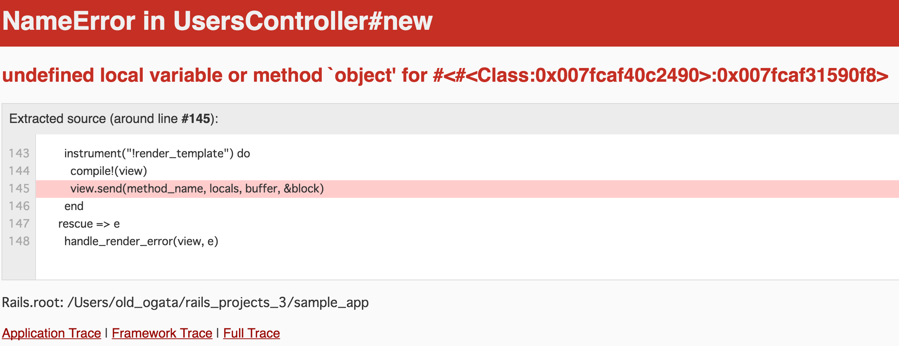

# エラー処理
作成日時:2021/6/20


## 1.エラー処理の誕生

エラー処理の書き方は2つある。

1. 返り値をかえす方法
2. エラー処理にジャンプする方法

しかし、1返り値をかえす方法は、2つの問題点がある。   
それは、`変数の見落とし`と`エラー処理のためにソースコードが読みにくくなる`こと。
その為、1返り値を帰すときは、
👀コードが失敗する可能性を意識し、失敗したときにどんなエラーが発生するのか明確にしておく必要があった。

一方、エラー処理にジャンプする方法は以前から方法を模索し、様々な形で発展してきた。

---

### エラー処理へジャンプする方法の発展

* エラーが起きたらジャンプする場所を予め登録しておく

**各言語ごとの歴史**
* UNIVACIの場合
  * 1950年に誕生したコンピュータ
  * 計算を実行して、オーバーフローが起きたら000番地に置いてある命令を実行
    * 後の「割り込み」
* COBOLの場合
  * 1954年に登場したFORTRANには例外処理は無かった
  * 1959年のCOBOLには２つのエラー処理が実装された
    * 1つ目のエラー処理は、もうデータが無いときなどに出力
    * 2つ目のエラー処理は、加減乗除を実行したときのオーバーフローなどに出力
  ```
    １｜READ エラーファイル AT END エラー時の処理
    ２｜ADD 関数名 ON SIZE ERROR エラー時の処理
  ```
  * 現代とは異なり、エラー処理をカスタマイズして増やすことは出来なかった
* PL/Iの場合
  * C言語ではif文で返り値をプログラマがチェックしていた
    * PL/Iは言語処理系が失敗をチェックする
  * 失敗の種類をカスタマイズして追加する機能が誕生
  * 定義した失敗をプログラマが発生させることができる
    * 今までは手動でエラーを発生
    * 例外処理にも受け継がれる要素へ

**エラー処理と例外処理のちがい**
- エラー処理
  - 失敗したら、エラーが書いてある所へ飛ぶ
- 例外処理
  - 先に失敗したときの挙動を記述
  - わざと失敗しそうなコードを書く

## 2.「失敗しそうなコード」をあえて書く、例外処理の仕組み
* John Goodenough
  * 1975年 より良い例外処理の方法を提案
    * プログラマーは命令が例外を投げる可能性があることを忘れる
    * 適切でない場所、適切ではない種類の例外処理を書く可能性がある
  解決法→
  1. 命令がどんな例外処理を投げる可能性があるか明示化
  2. 失敗しそうな処理を囲む構文

* 失敗しそうな処理を囲むとは？
  * try ~ catch文
  * APIの取得などに使用される
    * データがうまく取得できない可能性がある
      * データを取得出来たとき、出来なかった時を明示的に指示


* 失敗を囲む発展模様
  * CLUへの導入（1975~1977年）
    * 命令の後ろにエラー処理を書く
    * expect構文
      ```
        begin
          % 失敗しそうな処理
          % 失敗する格率が高そうな処理
        end expect when 失敗の種類 :
          % 失敗したときの処理
          % 失敗したときの処理
        end
      ```
  * C++への導入（1984~1989年）
    * 例外処理の議論の末に`try~catch文`が誕生
      ```
        try{
          /* 失敗しそうなコード */
          /* 失敗する格率が高そうなコード */
        }catch{
          /* エラー処理の命令 */
          /* エラー処理の命令 */
        }
      ```
    * 例外処理を走らせるときは`throw文`が導入
      * 「失敗を発生させる」＝「例外を投げる」という言葉の誕生につながる
      * PL/I,CLUでは例外発生時に`signal`を使用
        * C++では`signal`がライブラリで使用されており、導入できなかったらしい

## 3.どういうときに例外を投げるか？
* 例外を投げるタイミング
  * 関数でエラーが発生したときに伝える手段は2つ
    * 返り値を返す
    * 例外を投げる
  * 2つのエラー表示方法は場合によって使い分ける
    * 例外
      * 何をもって例外かは言語しそうによってことなる
        * 正解は無い
      * 間違えたら例外を投げる→間違えたらどこが異常なのか明示する
      
      ↓laravel
      
      
      ↓rails
      
        * 間違いが起きたら、システムを止めて報告をしてもらう
        * フェイルファースト
          * 間違いは間違いが起きた時点で修正をする事で、異常事態が発生するリスクを減らしていく

## 4. エラー処理まとめ
* 例外処理の問題点
  * 例外をもうけることで関数の出口が増える
    * 関数の正規ルート、例外処理による例外ルート
    * どこからプログラムが出たのか把握しきれないため、関数を抜ける際に行わなければならない処理が実行出来ない
      * 関数、変数の初期化など
    * 関数がどんな例外を投げるかコードだけでは分からない
* 例外処理を使うことの利点は上記の問題点を上回るほど大きい
* **新規プロジェクトでは例外を使用したテストを行うことが好ましい**
* 既存プロジェクトは、例外を使用することが難しい状態
  * 関数ルートと例外ルートで複数の出口がうまれるため
  * **既存では、返り値のデータを見落とさないようにテストを行う**


## 4.参考

* [エラーハンドリングの歴史](https://faithandbrave.github.io/article/error_handling.html)
* [イノベーションを巻き起こす「失敗の奨励」という考え方（フェイルファースト）](https://dentsu-ho.com/articles/605行う