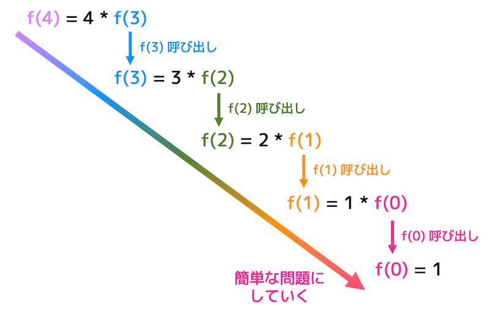
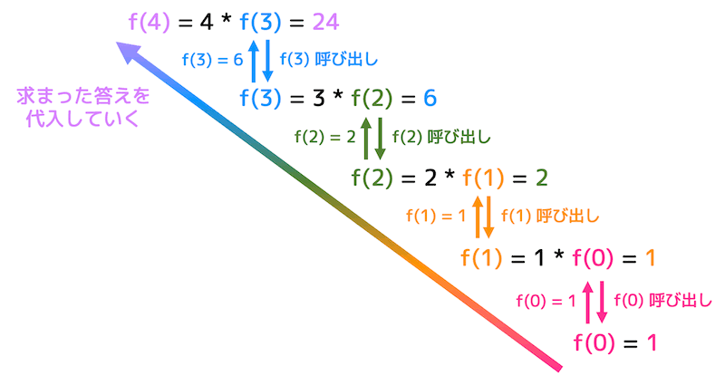

# 関数
作成日時:2021/6/12

memo
* しっかり理解することはできていないため、追記改善していく！！

---
## 1.関数とは
> コードの一部を一塊のものとして切り出し、それに名前をつける機能

* なぜ必要だったのか？
  * ソースコード全体を把握するのが難しいため、一部のコードに名前をつけてわかりやすくした
  * 関数＝部品
    * 例：電池の仕組みがわからなくても、電池を使えば電気が発生し、懐中電灯をともすことができる
      * 電池＝関数
  * 同じ仕組みを再度利用したいときに、何度も同じコードを書くとソースコードが肥大化する
    * 関数としてまとめれば、ソースコードを小さく分かりやすく整理することができる

## 2.関数の仕組み
* 関数の必須条件
  * 指定したコードのかたまりに名前をつけることができる
  * 関数を呼び出したら指定のコードを実行する
  * 実行が完了したら呼び出した場所にもどる
  * 実装に必要なもの
    * 呼び出したコードの位置を記憶
    * 戻る場所を記憶
  ```
    1 print start
    2
    3
    4
    5 function aisatu($input){
      alert($input + "hello");
    };
    6
    7
    8
    9 function aisatu()を実行 → 5に戻る
    10 実行が完了したら、ここからプログラムを再開
    11
    12
    13

  ```

* 関数を使用しない場合
  * `goto`
  * 指定したコードの位置へジャンプする
    * but!!!｜元の位置にもどる
    * gotoを使用すると、gotoの呼び出し元に帰ることができないため、gotoの次のコードからスタートすることに！
    
    

    出典：[Part3 制御構文を学ぶ](https://xtech.nikkei.com/it/article/lecture/20070122/259243/)

* 関数の誕生
1. ジャンプを使用した関数の実装
```
  1 110のジャンプ命令のジャンプ先を3に書き換える
  2 関数を呼び出す（100へジャンプ）
  3 次の命令
  ...
  100 関数の処理
  ...
  110 戻る（０へジャンプ）
```
  * 問題点
    * 戻り番地、呼び出し番地を組み込むのが難しい
2. 専用のメモリを使った実装
```
  1 戻り先メモリに３を入れる
  2 関数を呼び出す（100へジャンプ）
  3 次の命令
  ...
  100 関数の処理
  ...
  110 戻り先メモリに書かれた番地へ戻る
```
  * 問題点
    * 関数Xを呼び出しているときに、関数Ｙを呼び出すとメモリに登録した「戻り番地」が関数Ｙに上書きされる
    * 関数Ｘを呼び出した後の戻り番地が分からない💦
3. スタックを使用した関数の実装
  * スタック
    * データ構造
    * 複数の値を保存することができる
    * 後入れ先だし

      
      

      参照：[C言語 スタックメモリ【ローカル変数が確保される仕組みを解説】](https://monozukuri-c.com/langc-stack-memory/#toc7)
  
  * スタックを利用した戻り番地の登録
    * スタックはデータ構造になっているため、複数のデータを保存することができる
    * 関数Xが先に動き、途中で関数Yが動いても、別のメモリに戻り番地を保存すれば、上書きされない


4. 再帰呼び出し
* 関数という仕組みが生まれると、一連のコードをセットとして利用することができるため、何度も同じコードセットを呼び出せるようになる
* 関数Aを実行している中で、もう一度関数Ａを実行することを再帰呼び出し（再帰関数）という
  * 使い時
    * 何度も繰り返せば、期待する答えが返ってくるとき
    * どこまで関数を実行すれば終わりがあるのか明確になっているとき
* 実際の動き
  * 最初は、記述している終端まで計算を実行していく
    * 階段を下に下っていくイメージ
  
  * 次は、終端が判明したため、終端から順番に計算を実行し、計算結果を算出していく
    * 階段を上にあがっていくイメージ
  
※写真の出典：[うさぎでもわかる再帰関数のいろは](https://www.momoyama-usagi.com/entry/info-algo-saiki)

* プログラミング言語に再起呼び出しの仕組みをどうやって実装したのか？
  * 再帰呼び出しは関数を再び呼び出しているだけなので、プログラミング言語の中で動く仕組みとしては、関数と一緒
    * スタックを使用し、後入れ先出しの順番で**関数の番地と関数を実行後に戻る先**を保存することで関数を実行する
    * 再帰呼び出しを行うとスタックが不足することがあるのはコレが影響している
      * スタックが不足する＝プログラムとして改善の余地がある状態

参考：
・[再帰関数を学ぶと、どんな世界が広がるか](https://qiita.com/drken/items/23a4f604fa3f505dd5ad#0-%E3%81%AF%E3%81%98%E3%82%81%E3%81%AB)
・[再帰呼び出し](https://kaityo256.github.io/python_zero/recursion/index.html)