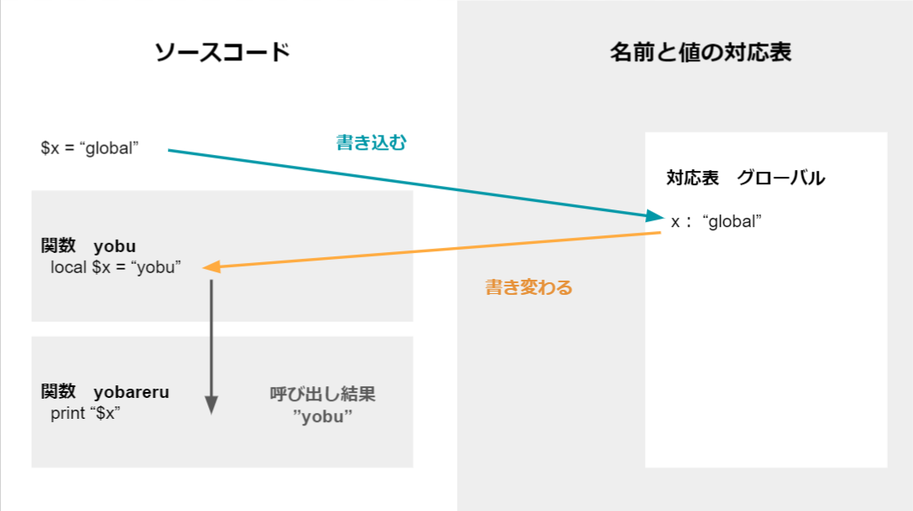
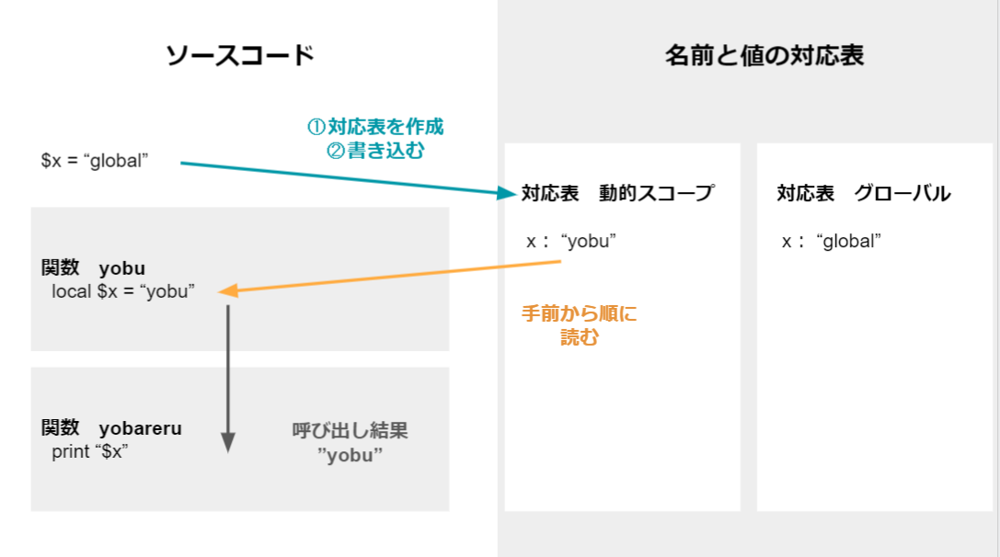
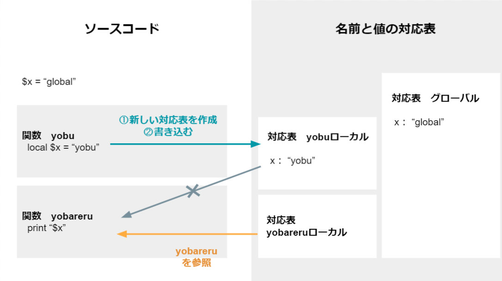
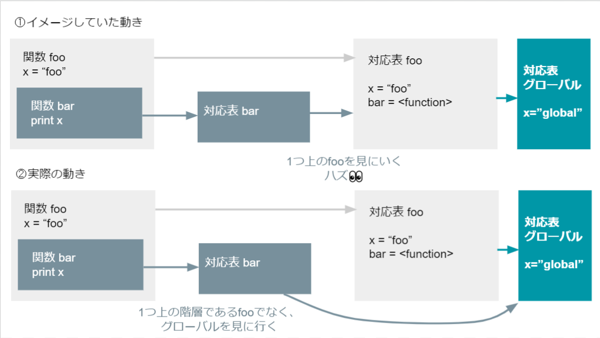
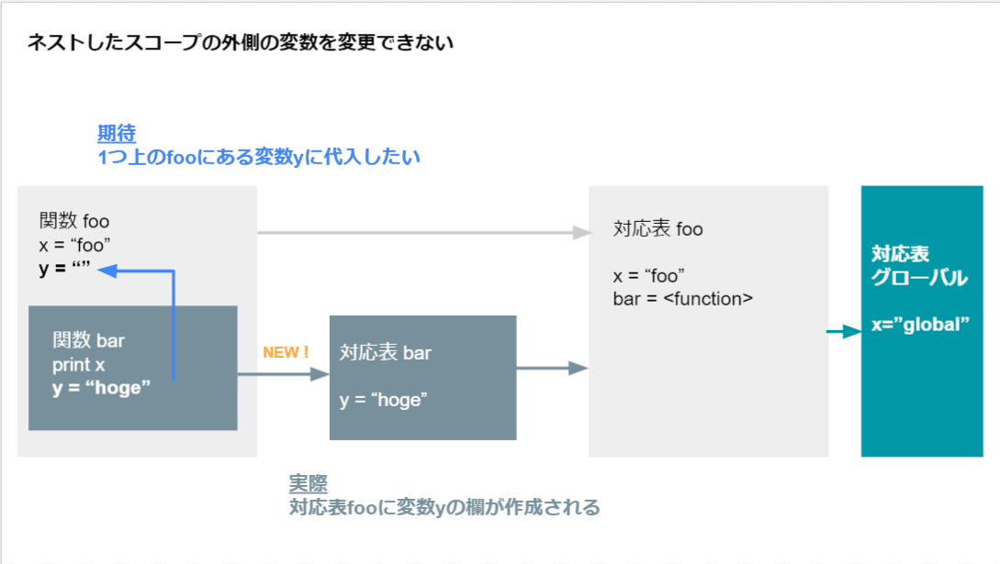

# 名前とスコープ
作成日時:2021/7/11

## 1.名前の必要性
* コンピューターがデータを記憶するメモリは番号で管理
  * 人間にとって分かりづらいため、名前をつけた
  
  ※イメージ図：[DNSとは？ドメインとサーバーの繋ぎ役](https://www.value-domain.com/media/dns/)
  * メモリの番号は確認するコマンドアリ

* 初期プログラミング言語では、1枚のホワイトボードに対応表を列挙しているような状態だった
  * 名前の衝突が発生
    * コードの量が増えると、どこでどの名前を何の為に使用していたのかを把握しづらい状態に
    * 同じ名前の変数を使用すると、中に入っていたデータが上書きされる
    * 例：for文の中で`$i`が上書きされて、無限ループへ
    ```
      for($i=0; $i<10; $i++){
          console.log("Hello");
          $i = 0;
      }
    ```
  * 衝突回避策
    * ホワイトボード状態＝名前の有効範囲がコード全体であるため、衝突が起こる
      * ＝グローバルスコープ・グローバル変数
    * 長い変数名をつける
      * 長い変数名や状態に応じた名前をつけることで、コードの可読性・衝突率を下げる
    * スコープを使用する

## 2.スコープの進化
* スコープ
  * 名前の有効範囲
  * ホワイトボードに名前をメモしていると、名前の衝突が起きる可能性が高い
    * 衝突を防ぐために、名前の有効範囲を狭くする
    * 例：
      * 関数x用の範囲を予め取っておいて、その中で指定した名前は関数x範囲内でのみ有効になる

* グローバルな対応表に書き込む


* スコープの種類
  * 動的スコープ
  * 静的スコープ

* **動的スコープ**
  * プログラム全体で、対応表を持つ関数を作成していた（複数のホワイトボードを共有している状態）
      * 対応表はコード全体から読める状態
      * グローバル変数…？？？
      * まだ、名前が衝突するリスクが高い状態だった
  > 関数の入り口で元の値をとっておき、出口で書き戻す
  * 変数を使用したら、使い終わったタイミングで変数の値を元に戻す（空にする）
  * 実行するタイミングで、入力される値がきまるため可変的
  * 対応表を見に行ったときに、動的スコープが作成した対応表に何も書いていなければ、グローバルな対応表を参照する
  
  ```javascript
    ## javascript
    function hoge(){
      var $fuga;
      ~ 省略 ~
      $fuga = 0;
    }
  ```
* 問題点
  * 最後に変数の値を0に戻すため、書き忘れる可能性がある
  * コードの流れを追っても、呼び出しもとが見つけにくい
  * 関数の中に書いた変数`$fuga`の中身を書き換えて、別の変数で呼び出しを行うと、呼び出しを行った別の関数に影響がおよぶ
  * 複数の関数で対応表を共有している

※イメージ図   




* **静的スコープ**
  * 新しい関数を作成するごとに、新しい対応表を作成する
    * 小さな専用ホワイトボードがたくさんできるイメージ
  * 多くの言語で静的スコープを採用
  
※イメージ図   


* スコープの動き

  * 動的スコープの場合は対応表を他の関数と共有で保持していたため、変数の中身が変化していた
    * 静的スコープは関数ごとに対応表が作成されているので、変数の中身が他関数の影響を受けて変化することはない
    * イメージ図の場合、対応表：yobareruに変数の定義がないため、グローバルな対応表を参照する
    * 厳密に言うと対応表は、関数の呼び出しごとに1つ作成される

* 静的スコープは、変数の汚染という問題を解消するために誕生している
  * 問題が起きないように影響範囲を小さく
  * グローバル変数を使用しないようにする！という原則の背景

* 問題点
  * ネストした関数のスコープ
    * 入れ子になったように見えるスコープが、実際は入れ子になっていない
      * 入れ子になった関数は、何もない場合、入れ子の外の関数の対応表を見ると考えられたが、実際はグローバルな対応表を見にいくようになっていた
    * 問題になったのは、`Python2.0`
      * `Python2.1`では①の動きになるように修正されている



  * ネストしたスコープの外側の変数を変更できない
    * Python / Ruby で問題が発生！！
    * Pythonの変数宣言方法が影響
      * pythonは代入で変数を作成する言語
      * 関数内で代入＝「あらたな変数の作成」と捉える
      * 外のスコープ（関数foo）へ関数barは影響は与えない
        * 一方で、関数fooへ干渉することもできない
    * Rubyの変数宣言方法が影響
      * 変数を宣言しない言語
      * 関数の形が複数あるため、ネストの形もいろんなパターンが存在
        * Rubyの関数
          * メソッド/ブロック
            * メソッドをネストした場合、スコープはネストしない（Ruby1.9）
          * メソッドの中でブロックを作成
            * メソッドのローカルスコープにある名前はメソッドのローカル変数とみなす
            * それ以外はブロックのローカル変数とする
            * ⚠ブロックの中で作成した変数がメソッドの変数と同じ名前になっていたら、書き換えが発生
            * ⚠外のスコープに影響を与える可能性がある

  


## 3.まとめ
- 動的スコープの対象範囲は、スコープに入ってから出るまでの時間軸
- 静的スコープの対象範囲は、コード内の特定のひとかたまり
- 動的・静的の概念は他の部分でも引き継がれている
  - アクセス装飾子（private/protected）
  - インポートしなければ、他のファイルに書いてある関数などが使用できない
- 理解しやすいコードを書くために、スコープの概念が活かされている


参考：
* [レキシカルスコープとダイナミックスコープ](https://jutememo.blogspot.com/2012/03/blog-post.html)
* [【JavaScriptの基礎】レキシカルスコープとクロージャを理解する](https://wemo.tech/904#index_id5)