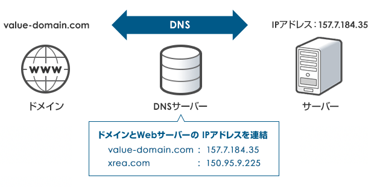

# 名前とスコープ
作成日時:2021/7/11

## 1.名前の必要性
* コンピューターがデータを記憶するメモリは番号で管理
  * 人間にとって分かりづらいため、名前をつけた
  
  ※イメージ図：[DNSとは？ドメインとサーバーの繋ぎ役](https://www.value-domain.com/media/dns/)
  * メモリの番号は確認するコマンドアリ

* 初期プログラミング言語では、1枚のホワイトボードに対応表を列挙しているような状態だった
  * 名前の衝突が発生
    * コードの量が増えると、どこでどの名前を何の為に使用していたのかを把握しづらい状態に
    * 同じ名前の変数を使用すると、中に入っていたデータが上書きされる
    * 例：for文の中で`$i`が上書きされて、無限ループへ
    ```
      for($i=0; $i<10; $i++){
          console.log("Hello");
          $i = 0;
      }
    ```
  * 衝突回避策
    * ホワイトボード状態＝名前の有効範囲がコード全体であるため、衝突が起こる
      * ＝グローバルスコープ・グローバル変数
    * 長い変数名をつける
      * 長い変数名や状態に応じた名前をつけることで、コードの可読性・衝突率を下げる
    * スコープを使用する

## 2.スコープの進化
* スコープ
  * 名前の有効範囲
  * ホワイトボードに名前をメモしていると、名前の衝突が起きる可能性が高い
    * 衝突を防ぐために、名前の有効範囲を狭くする
    * 例：
      * 関数x用の範囲を予め取っておいて、その中で指定した名前は関数x範囲内でのみ有効になる

* スコープの種類
  * 動的スコープ
  * 静的スコープ

* **動的スコープ**
  * プログラム全体で、対応表を持つ関数を作成していた（複数のホワイトボードを共有している状態）
      * 対応表はコード全体から読める状態
      * グローバル変数…？？？
      * まだ、名前が衝突するリスクが高い状態だった
  > 関数の入り口で元の値をとっておき、出口で書き戻す
  * 変数を使用したら、使い終わったタイミングで変数の値を元に戻す（空にする）
  * 実行するタイミングで、入力される値がきまるため可変的
  
  ```javascript
    ## javascript
    function hoge(){
      var $fuga;
      ~ 省略 ~
      $fuga = 0;
    }
  ```
    * 問題点
      * 最後に変数の値を0に戻すため、書き忘れる可能性がある
      * コードの流れを追っても、呼び出しもとが見つけにくい
      * 関数の中に書いた変数`$fuga`の中身を書き換えて、別の変数で呼び出しを行うと、呼び出しを行った別の関数に影響がおよぶ
      

* **静的スコープ**
  * 新しい関数を作成するごとに、新しい対応表を作成する
    * 小さな専用ホワイトボードがたくさんできるイメージ
      
    

参考：
* [レキシカルスコープとダイナミックスコープ](https://jutememo.blogspot.com/2012/03/blog-post.html)
* [【JavaScriptの基礎】レキシカルスコープとクロージャを理解する](https://wemo.tech/904#index_id5)