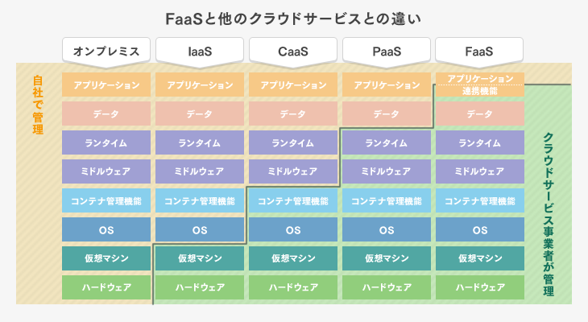

# サーバーレスアプリケーションのセキュリティ
作成日時:2021/9/24

## 1.サーバーレスアプリケーションとは？
* インターネット上に公開されているアプリは、どこかのサーバー上で保管されて、アクセスできるようになっている
* これまでは、自社でサーバーを保管してコードを配置し、運用していた
* サーバーレスでは、コードを書いたら実行環境の面倒を外部のサービスに任せることができる
  * サーバーの管理を自社で行うコストが減る

-> なぜ、サーバーを自分たちで管理しなくても良いのか？

## 2. クラウドサービスの発達
  * クラウドサービスとは？
    * 企業がサーバーなどのインフラ機能をサービスとして提供しているもの
    * インフラサービスの提供レベルは複数アリ（セキュリティやコンテナなど）
    * 今まではサーバールームなど実態を持っていたが、企業が提供しているどこかのサーバーを借りてインフラ機能を使用できるようになった（実態が無い）
    * 柔軟にサーバーの機能を拡大縮小することができる

* 参考：
  * [ゼロから学ぶサーバレスの歴史 FaaSの誕生がもたらしたもの](https://logmi.jp/tech/articles/314348)
  * [サーバーレスって何が便利なの ? AWS でサーバーレスを構築するためのサービスをグラレコで解説](https://aws.amazon.com/jp/builders-flash/202003/awsgeek-serverless/?awsf.filter-name=*all)
  * [なぜサーバーレスが注目されているのか？ゼロから学ぶサーバーレスアーキテクチャ（FaaS）入門](https://mmmcorp.co.jp/column/serverless/)

## 3.サーバーレスアプリケーションと従来のアプリケーション
* サーバレスとは？
  * ユーザーは、サーバ管理不要
  * すでに動くと分かっている環境が使用できる可用性
  * リクエストの量に柔軟に対応できる
* サーバーレスアプリケーションは、クラウドベンダーが提供するインフラ上でアプリケーションの開発に専念できる状態
  * FaaS
    * Function as a service
    * アプリケーションの実行・管理環境を提供
    * 利用者はアプリケーションの開発に専念できる
    * 例：AWS Lambda
      * [ 2021年度最新版クラウドサービスXaaS(Baas, Caas, Daas, Iaas, IDaas, IPaas, Paas, Saas, Faas)についてのまとめ](https://qiita.com/cocoa-maemae/items/6d9b6edc3082a678ed0f)
      * ※写真の略語も上記のリンクに記載アリ
  
  出典：[FaaSとは？サーバレスの意味やPaaS・CaaS・IaaSとの違いを解説](https://it-trend.jp/paas/article/301-0019)

* [サーバレスとコンテナを比較、選定の決め手はアプリケーション特性](https://techtarget.itmedia.co.jp/tt/news/1803/07/news05.html)

