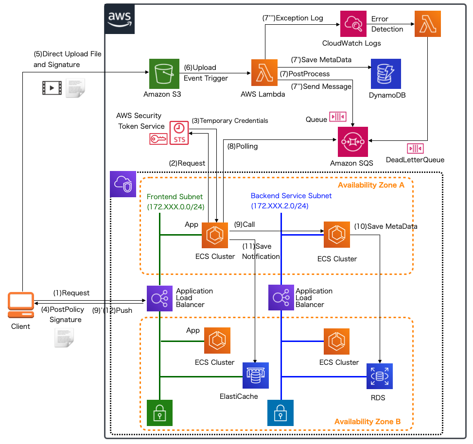

# サーバーレスアプリケーションの重大なリスク
作成日時:2021/10/6

## 1.サーバーレスアプリケーションとは？
(以前まとめた記事を参照すること！)[cloud\serverless_application.md]

## 2.重大なリスク一覧

- SAS-1: Function Event-Data Injection
- SAS-2: Broken Authentication
- SAS-3: 安全でないサーバーレスデプロイコンフィギュレーション
- SAS-4: 過剰な権限を持つファンクションのアクセス許可とロール
- SAS-5: 不適切な機能の監視とロギング
- SAS-6: 安全でないサードパーティとの依存関係
- SAS-7: Insecure Application Secrets Storage
- SAS-8: Denial of Service & Financial Resource Exhaustion
- SAS-9: Serverless Function Execution Flow Manipulation
- SAS-10: 不適切な例外処理と詳細なエラーメッセージ
- SAS-11: レガシー、または利用されていないサーバーレスファンクション、リソース、イベントトリガー
- SAS-12: CROSS-EXECUTION DATA PERSISTENCY

* 参考：[サーバーレスアプリケーションの最も危険なリスク12選](https://qiita.com/yuuhu04/items/ad38d6d35d358a90a60f)

## 3.重大なリスクの内容
#### SAS-1: Function Event-Data Injection
* これまで
  * アプリケーションインジェクションは、ユーザーから直接入力にのみ注意を払っていた
* サーバーレスアプリケーション
  * ユーザーの直接入力以外にもイベントのトリガーが生まれたため、多数のイベントソースからの入力に注意しなければならない
  * 例：
    * クラウドストレージイベント
    * SQLデータベースイベント
    * HTTP API呼び出し
    * SMS メッセージ通知、プッシュ通知、メールなど
  * サーバーレスで最も一般的なインジェクションの欠陥
    * Operating System (OS) command injection
    * Function runtime code injection (e.g. Node.js/JavaScript, Python, Java, C#, Golang)
    * SQL injection
    * NoSQL injection
    * Pub/Sub Message Data Tampering (e.g. MQTT data Injection)
    * Object deserialization attacks
    * XML External Entity (XXE)
    * Server-Side Request Forgery (SSRF)
* 対策
  * ユーザーが直接入力しないとはいえ、イベントソースから受け取るデータがすべて正しいものとは限らないため、チェックは必要
  * コードの権限が常に最小であること
    * 権限が大きいことで、他のソースにタッチされる可能性
  * イベントタイプとシステムのエントリポイントを全て洗い出す
  * HTTP/HTTPS トラフィックを検査する

#### SAS-2: Broken Authentication
* ファンクションのアクセス制御
* これまで（認証を例にあげる）
  * 自社で環境を用意できるため、認証用のプロバイダーを用意することができた
  * 独自に開発したものをテストするツールがたくさんあった
* サーバーレスアプリケーション
  * 様々なファンクションが連携して、システムが動いている状態
  * ファンクションの結合部分の脆弱性を攻撃される可能性がある
    * ユーザーから直接入力を受け取ることが無いからアクセス制御を甘くしていたら、狙われたなど
  
  参考：[【第4回】AmazonS3で発生したイベント契機で実行するサーバレスアプリケーション(1)](https://debugroom.github.io/mynavi-doc-draft/cloud_native/aws-s3-and-lambda-1.html)
* 対策
  * このファンクションにアクセスして良いものはどれか制御を徹底しておく必要がある
  * 対象ファンクションにどんなパターンでアクセスする可能性があるか整理
    * さらにアクセス関係対象となる他ファンクションやツールはどれか明確にしておく
    * 1ファンクションあたりの権限を最低限にする
  * サーバーレスアプリケーションの環境は、インフラがブラックボックスのため細かい仕様が分からず攻撃対策が不十分になる可能性あり
  * 他ツールと連携した独自アプリの脆弱性を検証するツールが無いため、クラウドベンダーが提供している物を使用する
  * 重要なデータ（ID・パスワード）や公ではない場（社内ネットワークなど）へファンクションを用いたアクセスを行う時はデータの受け渡しのアクセス制御や管理に十分気をつかう

#### SAS-3: 安全でないサーバーレスデプロイコンフィギュレーション
* クラウドベンダーが最初に提供しているデフォルトの設定は、適切ではないこともしばしば
* クラウドストレージの認証・承認が正しく構成されていない

* サーバーレスアーキテクチャの推奨設計
  * 機能をステートレスにする
    * ステートレスとは？
      * それぞれのアクションが独立したもの
      * 例：福岡県のお天気の情報をリクエストして、天気情報を返してくれるAPIなど
      * 参考サイト
        * [【初心者向け】REST APIについて学ぶ](https://pursue.fun/tech/about-rest-api/)
        * [Webアプリの基礎とさまざまな実行環境を理解する#3（社内勉強会）](https://techracho.bpsinc.jp/hachi8833/2018_08_17/60965)
  * 機能をステートレスにする場合
    * データの保持・保存をするた目のサーバーが必要
    * サーバーレスアプリケーションの場合は、クラウドストレージに保管する
    * しかし
      * 安全ではないクラウドストレージ構成のインシデントが発生
      * 上記のデータは、インターネット上で公開されており、誰でも簡単に利用できるため、被害が拡大
  * サーバーレスはクラウドに依存する為、必ずクラウド環境へのデプロイが必要
    * デプロイのフローの安全性を確保、保護する整備が必要
    * デプロイに関する業界基準などはまだ無いため、ベストプラクティスなどをいろいろと試すしかない
  * 対策
    * それぞれのクラウドの環境に応じて、クラウドベンダーが提供するベストプラクティスがあるため、特化させる
      * サービス依存で、他のサービスに応用出来ないこともあるが
    * 適宜、会社のセキュリティポリシーに沿っているか監視を行う

#### SAS-4: 過剰な権限を持つファンクションのアクセス許可とロール
* 最小特権の原則
  * ロジックを実行するために、**必要不可欠な最低限の特権**を付与
  * ひとつのファンクションの権限的脆弱性が連動して、システム全体のセキュリティ事故に発展する
* これまで
  * 使用ユーザーによって権限をわけていた
* サーバーレスアプリケーション
  * 実行する関数ごとに最適な関数が異なる
* 対策
  * IAM(Identity and Access Management)機能を使用して、各機能にユーザーロールを設定する

#### SAS-5: 不適切な機能の監視とロギング
* intrusion kill chain
  * サイバー攻撃は、アプリの脆弱性・弱点の調査からはじまる
  * 大きな被害につながったサイバー攻撃の被害者共通点
    * リアルタイムのインシデント対応ができていないこと
    * 攻撃の早期シグナル検出に対応できていないこと
* これまで
  * 組織内にデータセンタ―を設けていた
  * 独自にセキュリティやツールの開発、ログの収集をすることができた
* サーバーレスアプリケーション
  * 組織のデータサーバが組織の外にある（クラウド環境）こと
  * ログの収集はベンダーが提供しているツールや手段に依存する
    * 欲しいログ収集のスタイルが提供されている保障はない
      * 例：GUIのログツールがない、APIの提供のみなど
  * リアルタイムセキュリティイベントモニタリングを実現するためにロジックが必要
* 対策
  * 各種ログをとる
    * APIの使用
    * ログインのデータ
    * デプロイの成功・不成功
    * 権限の設定、変更のログ
    * ファンクションのトリガーログ
    * 障害レポートなど

#### SAS-6: 安全でないサードパーティとの依存関係
* サードパーティに脆弱性が潜んでいる可能性
* 堅牢なアプリケーションを開発していても、サードパーティがきっかけで脆弱なアプリケーションに
* 従来、サーバーレスアプリケーション問わず問題になっている事項
* 対策
  * 各種バージョンを適宜更新する
  * ソフトウェアスキャン！
  * 公式サイトで更新頻度を確認する（放置されていないか？など）

#### SAS-7: Insecure Application Secrets Storage
* アプリの動作で使用するシークレットキーの保存場所
* 例：
  * API keys
  * Database credentials
  * 暗号鍵
  * 機密性の高い構成設定
* プロジェクト内でシークレットキーを使用したとき、プロジェクトの読み取り権限をもつ全てのユーザーがキーをみることができる
  * 漏洩の危険性
* 従来
  * シークレット情報用のDB
  * 暗号化された単一集中構成ファイル
  * サーバーに対してアクセス制御
* サーバーレスアプリケーション
  * 各ファンクションごとにパッケージされるため、単一でシークレット情報の管理ができない
  * 環境変数を使用している場合、デプロイする人は閲覧できる可能性あり