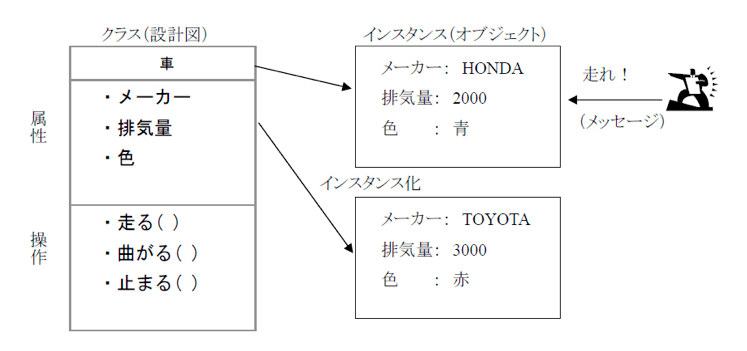

# クラスとオブジェクト
作成日時:2021/9/10

## 1.クラスとは
* > オブジェクト指向で出てくる概念のひとつで「それが、どんなものか」を表した設計図のこと
* クラス、オブジェクト、インスタンスという概念がセット
  * クラス：設計図
  * インスタンス：設計図（クラス）から生成されたモノ
  * オブジェクト：クラスとかインスタンスをふんわり表現したもの

例：AWS-SDK(node.js)を使用してS3にアクセスする
```javascript
// AWS-SDKの中のS3クラスを使用
// s3というクラスを生成（インスタンス）
var s3 = new AWS.S3(); 
// AWS.S3クラス（設計図）に入っている「abortMultipartUpload」という機能を使用
s3.abortMultipartUpload(params, function (err, data) {
  if (err) console.log(err, err.stack); 
  else     console.log(data);
});
```
出典：[Sending a Request Using S3](https://docs.aws.amazon.com/AWSJavaScriptSDK/latest/AWS/S3.html)

## 2.オブジェクトとは
* クラスやインスタンスのこと
* 対象や物をあらわす
  * 設計図にもとづいて作られたものがインスタンス（オブジェクト）
* 属性（プロパティ）や操作（メソッド）をもつ
  * 属性：対象の物に対する情報
  * 操作：何らかの動きができる

参考：[初心者向けに徹底解説！オブジェクト指向とは？](https://eng-entrance.com/what-oop)


## 3.オブジェクト指向
* 言語によって意味が異なるというかエンジニアによって解釈が異なる
* オブジェクトに注目した考えかた
* Object-Oriented（オブジェクト・オリエンテッド）
  * OOと表記されることもある
* 現実世界のモノに注目した考え方
  * オブジェクト
    * もの
    * 今回は、冷蔵庫を例に使用
      * 大きい
      * 冷たい
      * 白
  * クラス
    * 冷蔵庫の設計図
    ```
      class 冷蔵庫(){

      }
    ```
  * プロパティ
    * オブジェクトが持つ特徴を説明するもの
    ```
      class 冷蔵庫(){
        color = 白;
        size = 大きい;
        function = 冷たい;
      }
    ```
  * メソッド
    * オブジェクトの動きを説明するもの
    ```
      class 冷蔵庫(){
        color = 白;
        size = 大きい;
        function = 冷たい;
      }

      function ひやす(食べ物){
        // 食べ物を冷やす
      }
    ```
  * メッセージング
    * オブジェクト同士をメソッド介して連携させる
    ```
      class 冷蔵庫 {
        color = 白;
        size = 大きい;
        function = 冷たい;
      }

      function ひやす(食べ物) {
        // 食べ物を冷やす
      }

      class 人間 {
        name = ほげ子;
        age = 20;
        move = 食べ物を冷やしたい;
      }

      function main() {
        food = アイス;
        人間.ひやす (food))
      }
    ```
* 参考：[オブジェクト指向が5000%理解できる記事](https://qiita.com/ICT_hero/items/b2f8e39d7cc23ad505f9)

## 4.クラスとオブジェクト