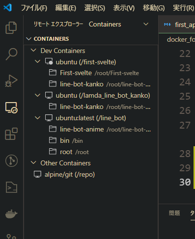

# docker コンテナをつくって Hello world!するまで
---

## 1 コンテナを作成して入る
`sudo docker run --name "コンテナ名" -i -t イメージ名 /bin/bash  `

## 2 すでに作成していたコンテナを起動する
`sudo docker start コンテナID`

※コンテナIDの調べ方
`docker ps -a`

## 3 コンテナの中のシェルに入る
`docker exec -it コンテナID /bin/bash`
## 4 コンテナの中で環境を構築する
- apt-getを最新版にする: `apt-get update`
- sudo : `apt-get install sudo`
- vim : `sudo apt-get install vim`
- git : 
  - `sudo apt-get install git`

  - gitのユーザー情報を確認する（`git config -l`）
    もしも、登録が出来ていない時は、名前・メールアドレスを登録する
    - `git config --global user.name [名前]`
    - `git config --global user.email [メールアドレス]`
  - ユーザー設定が確認できれば**リポジトリの作成＋push**が行える

## ※ 作成したコンテナをvscodeで操作（GUI）
- リモート接続（SSHなど）ができる拡張機能を使う
- dockerの拡張機能から`attach vscode`を実行すると成功しないことがある
---
- リモート接続できるコンテナから、起動させたいコンテナを選択
- 指定コンテナの上にマウスを置き、フォルダーアイコン`Attach to Container`を実行
