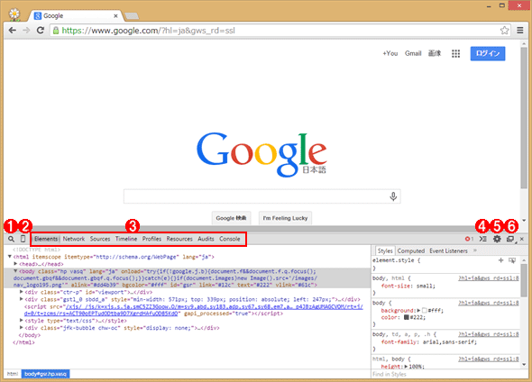

# google devlopers tools
作成日時:2021/8/3

## 1.google chrome developers tools
* F12もしくは、右クリック「検証」を押す事で表示することできるツール

>デベロッパーツールを起動したところ   
1Webページ上の要素を、マウスを使って選択できる。虫眼鏡アイコン。   
2スマートフォンなどの表示を確認するためのエミュレーション・ウィンドウの表示／非表示を切り替える。デバイスモード・アイコン。   
3各タブは「パネル」と呼ばれており、このパネルで機能を切り替えることができる。   
4デベロッパーツールの下部へのドロワー（※その中にはConsole／Search／Emulation／Renderingタブがある）の表示／非表示を切り替える。ドロワー（＝引き出しを意味する「drawer」）は、実際に引き出しのように下からスライドして表示されたり、隠されたりする。   
5デベロッパーツールの詳細な設定をする設定ダイアログの表示／非表示を切り替える。   
6デベロッパーツールを別ウィンドウにするか、下辺か右辺のいずれかにドックするかを切り替える。   

出典：[Web開発でよく使う、特に使えるChromeデベロッパー・ツールの機能](https://www.buildinsider.net/web/chromedevtools/01)

* 多機能で、サイト上のさまざまな情報を取得・操作することができる

## 2.開発における応用的な使い方
* サイトの情報から、特定のデータを取得したい時
  * セレクターを使用して特定の要素を選択
  * プロパティが出現し、html/cssに関する情報が取得できる
* 参考:[Chrome デベロッパーツールの Console を使いこなす](https://qiita.com/howdy39/items/c22c2cfafab88fa73d15)
