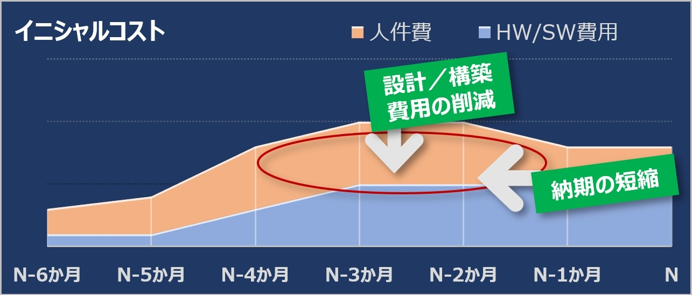

# Infrastructure as a Code
作成日時:2021/8/23

## 1.Infrastructure as a Code（IaC）とは？
> 「設備が存在しないわけではなく、抽象化されて、使う側としては意識しないもの」
> 抽象化され、現物を意識しなくなり、目に見えない「リソース」と化したシステムインフラは、どのように構築し、制御・運用するのか？その答えの1つがIaCと言える。

概要: インフラ部分をコードで管理すること
  - 今までは自社でサーバールームを持ち、サーバーを管理していた
  -> サーバーの管理をコードで実行するようにした（IaC）

## 2.IaCの背景とメリット
- 自分でサーバーを管理する場合は、様々なソフトや設定管理などが必要になる
- 0からサーバーを管理するとなると、必要な作業がすごく増える
- 💭 サーバー管理で想定される状況
  - サーバー内はソフトの更新ができているが、ドキュメントが追いつかない（残っていない）
  - 物理的にサーバーを管理できる人員が必要
  - 手順が複雑で、復元までが大変

- コードでインフラを管理するメリット
  - コードに予め設定を書いておけば、復元しやすくなる
  - コードはgithubなどのツールで保管できる
  - 環境構築作業を自動化することもできる
    - 人件費の削減
    - 人為的なミスの低下
      - -> インフラ管理コストの低下
  
  

## 3.IaCツール
- Docker
  - docker fileでdockerの状態を管理する
  - docker fileがあれば、環境を再現・複製することも可能

## 参考
* [Infrastructure as Code（IaC）とは何か？ツールは何を使う？どう構築すべき？](https://www.sbbit.jp/article/cont1/39402)
* [Infrastructure as Code（IaC）とは？インフラをコードとして管理でき、コスト削減などのメリットも！](https://udemy.benesse.co.jp/development/system/iac.html)
