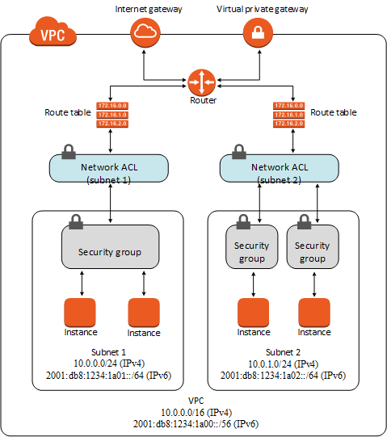

# Security Group
作成日時:2022/02/08

## 1.セキュリティグループ
* VPCの仮想ファイアウォール
  * ファイアウォール
    * ネットワークへのデータの出入りをコントロールする仕組みのこと
  * コントロールするもの
    * ※必ず下記どちらかのコントロール設定をする必要がある
    * インバウンドトラフィック
      * データが入ってくること
    * アウトバウンドトラフィック
      * データが出ていくこと

## 2.類似するもの：ネットワークACL
- 大きな違い
  - 対象となるリソース
    - ネットワークACLは、サブネットレベルで動作する
    - セキュリティグループは、インスタンス単位で動作する
    - 一般的な構成
      - VPC > sabunet > EC2
      - VPC > sabunet(NACL) > EC2(SG)
    - ネットワークACL→セキュリティグループの順番で制御が掛かる

セキュリティグループ | ネットワーク ACL
-- | --
インスタンスレベルで動作します。 | サブネットレベルで動作します。
ルールの許可のみがサポートされます | ルールの許可と拒否がサポートされます
ステートフル: ルールに関係なく、返されたトラフィックが自動的に許可されます | ステートレス: 返されたトラフィックがルールによって明示的に許可されます
トラフィックを許可するかどうかを決める前に、すべてのルールを評価します | トラフィックを許可するかどうかを決定する際に、最も低い番号のルールから順にルールを処理します。
インスタンスの起動時に誰かがセキュリティグループを指定した場合、または後でセキュリティグループをインスタンスに関連付けた場合にのみ、インスタンスに適用されます。 | 関連付けられているサブネット内のすべてのインスタンスに自動的に適用されます（そのため、セキュリティグループのルールの許容範囲が広すぎる場合は、保護レイヤーを追加する必要があります）。

出典 公式ドキュメント：https://docs.aws.amazon.com/ja_jp/vpc/latest/userguide/VPC_Security.html

## 3. ルール
- インバウンドルール
  - VPC内に入ってくるトラフィックに対して対応するルール
- アウトバウンドルール
  - VPC外に出ていくトラフィックに対して対応するルール

- どのIPアドレスからのアクセスに対してアクセス許可を行うのか、どんな方式でのアクセスに対して許可を行うのかなどを設定することができる

## 4.ウェルノウンポート
- ポートとは？
  - 通信の口のこと
    - web、メール、FTPなど様々なアプリごとにポートが割り当てられる
    - アプリが稼働しているときは、対応したポートが待ち受け（開いて）いる状態となる
  - ポート番号は、TCP/UDP上のサービスを識別するための番号
- 既に通信の内容が予約されているポート
  - 代表例：
    - http:80
    - https:443
    - ssh:22
    - imap3:220

- ウェルノウンポートの詳細記事：https://www.infraexpert.com/study/tea5.htm