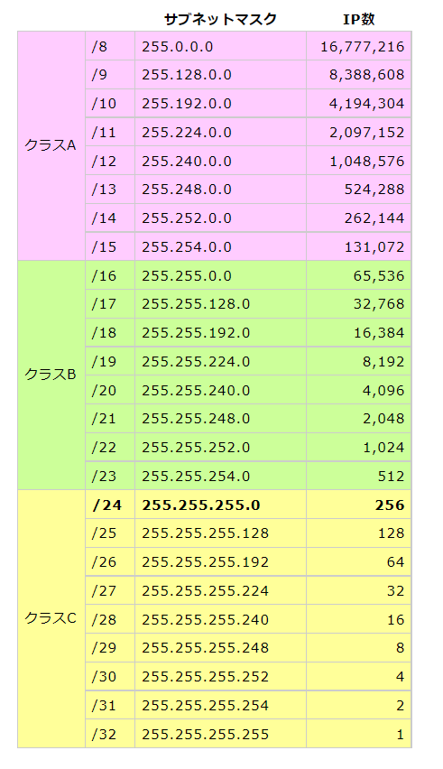

# サブネット
作成日時:2021/11/24

※AWSの環境を前提にメモ

## 1.サブネットとは？
* 仮想ネットワークであるVPCの中で細分化されたネットワーク
  * 細分化されたネットワーク
    * Aサブネット・Bサブネットそれぞれに役割を与える事が出来る
      * Aサブネットは公開
      * Bサブネットは非公開
    * サブネット同士は、ルーターを介して通信を行う
      * VPC同士はルーターなしでも互いに接続ができる
  * VPCのIPアドレス範囲
* ３つのサブネット
  * パブリックサブネット
    *  > サブネットのトラフィックがインターネットゲートウェイにルーティングされるサブネット
    * インターネットゲートウェイに接続するサブネット
  * プライベートサブネット
    * > インターネットゲートウェイへのルートがないサブネット
    * インターネットゲートウェイに接続しないサブネット
  * VPN のみのサブネット
    * > トラフィックが [Site-to-Site VPN](https://docs.aws.amazon.com/ja_jp/vpn/latest/s2svpn/how_it_works.html) 接続の仮想プライベートゲートウェイにルーティングされているサブネット
    * プライベートゲートウェイに接続するサブネット
* 参考：https://docs.aws.amazon.com/ja_jp/vpc/latest/userguide/VPC_Subnets.html

## 2.サブネットのサイズ
* 10.0.0.0/24などのサブネットに割り当てることができる範囲

出典：https://www.ahref.org/doc/ipsubnet.html
* [勘違いしてない？IPアドレスとサブネットマスクの仕組みを図で再確認](https://xtech.nikkei.com/atcl/nxt/column/18/00780/052700002/)

## 3.CIDR表記
- ネットワークやサブネットの範囲をわけるさいは、`CIDR`表記を用いる
  - 別名：プレフィックス表示
  - 書き方： /数字
    - 別の書き方：サブネットマスク（255.255.255.0, 255.255.240.0など）
- CIDRが表すもの
  - IPアドレスの数
    - /24: 256個
    - /20: 4096個
- 関連する項目:サブネットマスク(https://medium-company.com/%E3%82%B5%E3%83%96%E3%83%8D%E3%83%83%E3%83%88%E3%83%9E%E3%82%B9%E3%82%AF/amp/)
